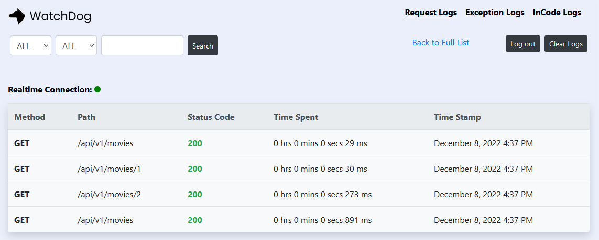

[](https://github.com/aimenux/WatchDogDemo/actions/workflows/ci.yml)

# WatchDogDemo
```
Using WatchDog for request/response/exception logging
```

> In this repo, i m using [WatchDog](https://github.com/IzyPro/WatchDog) for request/response/exception logging in a basic web api built with 2 ways :
>
> - `WayOne` : based on mvc approach
>
> - `WayTwo` : based on minimal api approach
>
>
> 
>

**`Tools`** : net 8.0, web api, watch-dog, ef-core, xunit, fluent-assertions, nsubstitute
